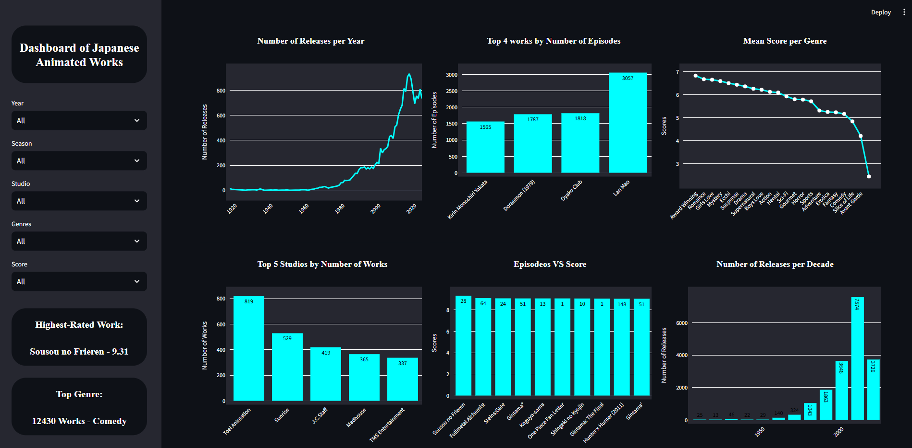

# Dashboard of Japanese Animated Works

---

## Table of Contents

- [About the Project](#about-the-project)
- [Access the Dashboard](#access-the-dashboard)
- [How it Works](#how-it-works)
- [How to Use](#how-to-use)
- [Tech Stack](#tech-stack)
- [Author](#author)

---

## About the Project

This project performs an exploratory analysis of a dataset of anime titles extracted from MyAnimeList. The analysis answers various questions about popularity, ratings, most frequent genres, most productive studios, and other relevant information.

---

---

## Access the Dashboard 

[Japanese Animated Works](https://dashjapaanimworks.streamlit.app/)

---

## How it Works

- The data is obtained from Kaggle and loaded using Pandas.
- The data is cleaned and organized to facilitate analysis.
- Interactive charts are generated using Streamlit and Plotly for visualization.
- The user can filter the anime by year, season, genre, rating, and studio to customize the analysis.
- Various metrics are calculated to answer the questions, such as average ratings by genre and the relationship between number of episodes and ratings, among others.

---

## How to Use

Clone the repository to your local environment:

        git clone https://github.com/joao-pedro-dp/Dashboard_Japanese_Animated_Works

Install the dependencies listed in the `requirements.txt` file:

        pip install -r requirements.txt

Run the Streamlit application:

        streamlit run Japanese_Animated_Works.py

---

## Tech Stack

1. kagglehub
2. pandas
3. streamlit
4. plotly.express

---

## Author

Created by João Pedro de Paula.

